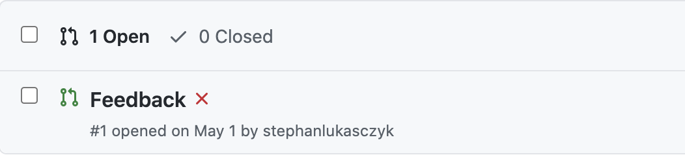
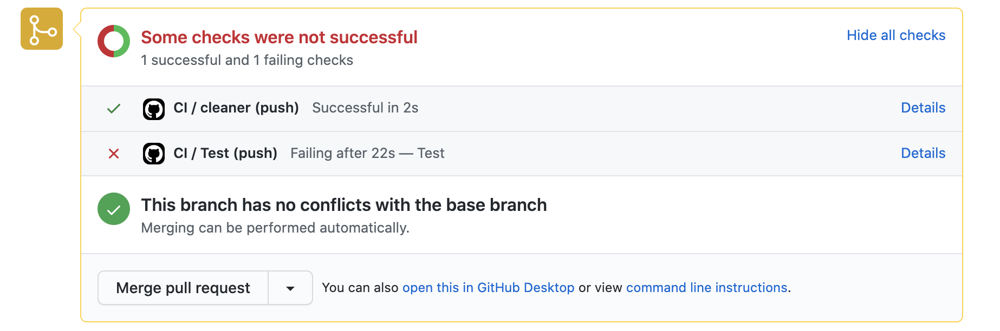

# Programming Styles -- WiSe 20-21
---------------
# Grading and Submission

In each assignment, you are asked to complete two programming tasks, one in Java and one in Javascript, and to provide description of your solution.

Programming tasks are evaluated in terms of their correctness, adherence to the various programming styles, general organization, code quality and clarity in the code comments. The description is evaluated in clarity, organization, and soundness.

Students have the responsibility to identify, reports and possibly fix problems and shortcomings in the assignments' material. Additional **bonus** points can be earned by the students that contribute to the class by implementing additional public tests, improving documentation, task descriptions, and, in general, sharing anything that can be useful to the other students dealing with the assignments. Sharing the solution of the assignments is, of course, not possible.

## Plagiarism
All the submissions undergo a plagiarism check that consists of manual code inspection and the use of standard software for plagiarism checking. Depending on the severity of the situation, plagiarism is punishable with class failure, or the loss of all the points of the assignments.

## Build scripts
To enable automatic testing, each of the submitted solutions comes with a `makefile` that implements some build targets. Please do not modify this file as the continuous integration system relies on it!

The following targets should be there (but in general they might be more/different):

- `clean`: to clean up all the generated resources (e.g., compiled classes).
 
 > NOTE: Do not commit generated resources, log files, and nodes_modules. A `.gitignore` file is generally provided, so unless you use `git --force` those files should not end up in your repo.
 
- `test`: to test your code using public tests. This triggers the build process for java programs as well. Testing assumes that you have installed and setup your project correctly.

A predefined makefile is provided along with the assignment so you can code your solution around that. This script makes some assumptions on where files are located and how projects are set up, so it won't work if you do not follow them.

The automated testing infrastructure will use the make script to clean up, rebuild and prepare your submission for the execution in the system tests.

## Valid submissions

### Public tests
Be sure that your submissions passes **ALL** the public tests on the continuous integration system. Submissions that do not pass **ALL** the public tests on the continuous integration system will not be considered valid, i.e., you will give zero points. That is, even if your solution passes the public tests on your local installation, it will still be considered wrong if it does not pass the tests on the automated testing infrastructure.

Public tests can be found at [https://github.com/se2p/ps-wise-2021-public-tests](https://github.com/se2p/ps-wise-2021-public-tests)

### Private tests
In addition to public tests, students submission are executed against a set of private tests. Correct solutions should pass all the private tests as well; however, solutions that do not pass all the private tests will not be considered completely invalid, so they will not be rejected by default. Depending on how many private tests fail, student solutions will lose more or less points. 

### Automatic test execution
The automated testing infrastructure is available since the moment the assignments are given to students and will trigger *at every code commit* automatically. However, because this infrastructure is shared among the students, your tests might be queued, hence it might take a bit before the tests are executed. Once the tests execute, you should see a badge on your GitHub page like this:

The red cross indicates that the CI job failed. You can find more info inside the `Feedback` Pull Request, if you click on "Details".

So if students commit their code frequently, they will received a feedback from the automated testing infrastructure directly on their git repo giving them more time to fix bugs.

## Code comments and solution description
Student submission must respect **all** the constraints defined by the target programming styles; however, it might not be always possible to do so. To avoid any confusion and misunderstanding, the students must reasonably comment their code and provide the necessary details on the description of their solution (`DESCRIPTION.md`).
The difference between code comments and solution description is that code comments are *punctual and localized*, as they apply exactly on the code they are applied on. The solution description, instead, is *general* and describe the approach to the solution and its most relevant points.

Code comments and solution description help in understanding the reasoning behind students' programs and, more importantly, explain (potential) style violations. Note that the default behavior in the absence of suitable code comments or a sound description is to consider any solution that violate the programming styles as wrong.